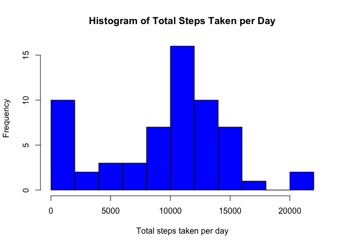
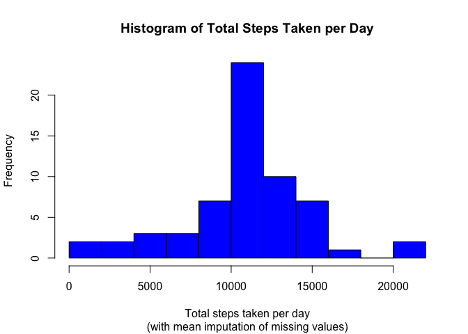
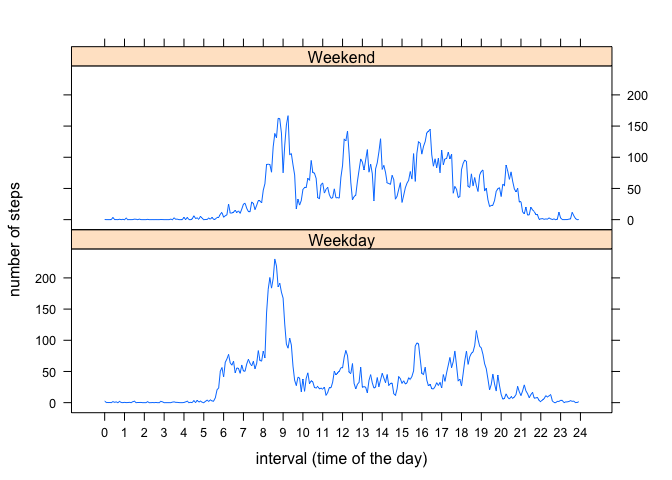

# Reproducible Research: Peer Assessment 1

## Introduction

It is now possible to collect a large amount of data about personal movement using activity
monitoring devices such as a [Fitbit][1], [Nike Fuelband][2] or [Jawbone Up][3]. These type
of devices are part of the “quantified self” movement – a group of enthusiasts who take
measurements about themselves regularly to improve their health, to find patterns in their
behavior, or because they are tech geeks. But these data remain under-utilized both because
the raw data are hard to obtain and there is a lack of statistical methods and software for
processing and interpreting the data.

This assignment makes use of data from a personal activity monitoring device. This device
collects data at 5 minute intervals through out the day. The data consists of two months of
data from an anonymous individual collected during the months of October and November, 2012
and include the number of steps taken in 5 minute intervals each day.


## Loading and preprocessing the data

The data for this assignment (the file **activity.zip**) is in the same [GitHub respository][4] as the code is, but also can be directly downloaded from the course web site:

+ Dataset: [Activity monitoring data][5] [52K]

The variables included in this dataset are:

+ steps: Number of steps taking in a 5-minute interval (missing values are coded as NA)
+ date: The date on which the measurement was taken in YYYY-MM-DD format
+ interval: Identifier for the 5-minute interval in which measurement was taken

The dataset is stored in a comma-separated-value (CSV) file and there are a total of 17,568 observations in this dataset.

Using the following R code the data set is loaded into the variable *activity_data*:


```r
library(R.utils)
# Read activity data from the local activity.zip file
zip_file <- "activity.zip"
csv_file <- "activity.csv"
activity_data <- read.csv(unz(zip_file, csv_file), header=TRUE, sep=",")
```


## What is mean total number of steps taken per day?

Once the data set is loaded, the following R code is used to obtain the total number of steps taken each day and generate it's corresponding historgram, along with the mean and median values:


```r
total_steps <- aggregate(x = activity_data["steps"], FUN = sum, na.rm = TRUE,
                         by = list(date = activity_data$date))
mean_steps <- mean(total_steps$steps, na.rm = TRUE)
median_steps <- median(total_steps$steps, na.rm = TRUE)
hist(total_steps$steps, breaks = 10, freq = TRUE, col = "Blue",
     main = "Histogram of Total Steps Taken per Day",
     xlab = "Total steps taken per day")
```

 

Notice that missing values are *"ignored"* using the **na.rm = TRUE** parameter in the sum,
mean and median calculations, which actually is equivalent to having an imputation strategy
of *"Set all NA's equal to zero"*.

Using this approach, the mean number of steps taken per day is **9354.23** and the median is **10395**.


## What is the average daily activity pattern?

To calculate the average daily activity pattern and generate it's corresponding time series
plot, the following R code is used:


```r
average_steps <- aggregate(x = activity_data["steps"], FUN = mean, na.rm=TRUE,
                           by = list(interval = activity_data$interval))
max_steps <- max(average_steps$steps)
max_interval <- average_steps$interval[average_steps$steps == max_steps]
plot(steps ~ rownames(average_steps), average_steps,
     main = "Average Daily Activity Pattern", 
     xaxt = 'n', xlab = "interval (time of the day)", ylab = "number of steps", type = "l")
axis(side = 1, at = seq.int(1, nrow(average_steps)+1, 12), labels = 0:24)
```

 

Notice that missing values are still being *"ignored"* using the **na.rm = TRUE** parameter
in the aggregate function to compute the daily average/mean.

From the time series plot above, it can be observed that **8:35** is the 5-minute interval of the day with the
maximum number of steps on average, with a value of **206.1698**
steps.


## Imputing missing values

To deal with days/intervals where there are missing values (coded as NA) and avoiding bias
introduction into some calculations or summaries of the data, the strategy followed
consisted in imputing missing values of intervals in the original data set with the mean
for that 5-minute interval. The R code to perform this imputation strategy and recalculate
the total number of steps taken each day, the mean and median values and generate an
alternate un-biased historgram, is the following:


```r
na_steps <- sum(is.na(activity_data$steps))
na_percent <- na_steps / length(activity_data$steps) * 100
activity_no_nas <- data.frame(cbind(activity_data, average_steps))
activity_no_nas$steps[is.na(activity_no_nas$steps)] <-
    activity_no_nas$steps.1[is.na(activity_no_nas$steps)]
activity_no_nas$interval.1 <- activity_no_nas$steps.1 <- NULL
total_steps2 <- aggregate(x = activity_no_nas["steps"], FUN = sum,
                          by = list(date = activity_no_nas$date))
mean_steps2 <- mean(total_steps2$steps)
median_steps2 <- median(total_steps2$steps)
hist(total_steps2$steps, breaks = 10, freq = TRUE, col = "Blue",
     main = "Histogram of Total Steps Taken per Day",
     sub = "(with mean imputation of missing values)",
     xlab = "Total steps taken per day")
```

 

The total number of missing values in the steps column of the original activity dataset is
**2304**, which represents a **13.11%**
from the total observations.

Using the strategy of mean imputation of the 5-minute interval to replace the missing
values, the mean number of steps taken per day is **10766.19**
and the median is **10766.19**.

Comparing both histograms, it can be seen that using the mean imputation strategy
eliminates the bias caused by the large number of missing values, initially treated as
zeros.

It can also be seen that the second histogram, produced with the mean imputation strategy,
has a shape that is more like a normal disbribution without the left fatter tail induced by
the zero values (missing values) of the first histogram.

## Are there differences in activity patterns between weekdays and weekends?

Finally, to compare the differences in activity patterns between weekdays and weekends,
the following R code, that reclasifies and aggregates observations between weekdays and
weekends, is used:


```r
activity_no_nas$day <- as.factor(ifelse(weekdays(as.Date(activity_no_nas$date))
                                        %in% c("Saturday","Sunday"), "Weekend", "Weekday"))
week_average <- aggregate(x = activity_no_nas["steps"], FUN = mean,
                          by = list(day = activity_no_nas$day,
                                    interval = activity_no_nas$interval))
library("lattice")
xyplot(steps ~ as.integer((as.numeric(rownames(week_average))+1)/2) | 
           factor(week_average$day), data = week_average, 
       xlab = "interval (time of the day)",
       ylab = "number of steps", 
       type = "l", layout = c(1,2),
       scales = list(x = list(at = seq.int(1, nrow(average_steps)+1, 12), labels = 0:24)))
```

 

As it can be seen, the notorious activity spike from 8:00 to 9:00, detected in the first
time series plot, is produced during weekdays, whereas weekends tend to have less
volatility on average.

[1]: http://www.fitbit.com/                                 "Fitbit"
[2]: http://www.nike.com/us/en_us/c/nikeplus-fuelband       "Nike Fuelband"
[3]: https://jawbone.com/up                                 "Jawbone Up"
[4]: https://github.com/jcampero/RepData_PeerAssessment1    "GitHub repository"
[5]: https://d396qusza40orc.cloudfront.net/repdata%2Fdata%2Factivity.zip "Activity monitoring data"
